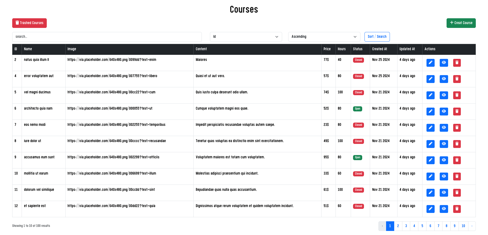

## Laravel Project Applying
1. CRUD Operation
2. SoftDelete 
3. Restor data
4. Pagination
5. Traits
6. Upload & Store Files
7. Form Validation
8. Seeding
9. Migrations
10. Bootsrap over tailwind css
11. Sorting
12. Searching
